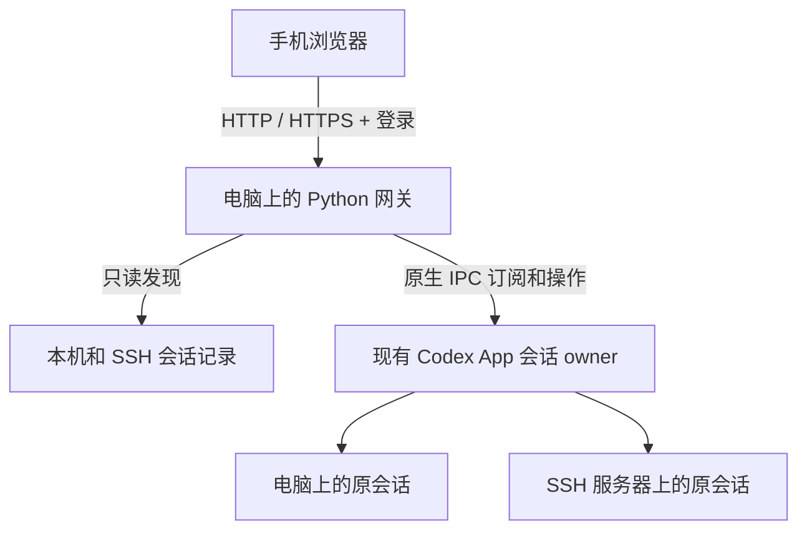

<p align="center">
  
</p>

# Codex App 手机网关

> **v2.0.0-preview.2 预览版**：[发布与下载](https://github.com/try2love/codex-mobile-bridge/releases/tag/v2.0.0-preview.2) · [Web / App 工作台介绍](https://try2love.github.io/codex-mobile-bridge/#preview) · [手机安装说明](mobile/README.md)。预览版需主动安装，不向正式版用户推送。手机后台通知尚未接通。


[简体中文](README.md) · [English](README_EN.md)

**[双语介绍与使用演示 ↗](https://try2love.github.io/codex-mobile-bridge/?lang=zh)** · **[下载桌面 App](https://github.com/try2love/codex-mobile-bridge/releases)**

[](https://try2love.github.io/codex-mobile-bridge/?lang=zh)

在手机浏览器里，继续电脑 **Codex App 已有的聊天**，或在已保存项目中新建聊天。

手机与电脑打开同一个会话，查看回复、发送消息、选择模型与 Skill、回应待确认操作。本地任务继续在原电脑执行，SSH 任务继续在原服务器执行；模型请求沿用该会话的提供商与认证配置。

**不要求手机登录与电脑相同的 OpenAI 账号。** 网关提供独立的账号密码登录，也支持显式开启免密访问。可以通过局域网、临时 HTTPS 隧道或自己的反向代理连接。

> 社区项目，与 OpenAI 无隶属关系。支持 macOS 和 Windows，依赖 Codex App 的内部 IPC；各平台的实测范围见 [验证记录](VERIFICATION.md)。App 更新后可能需要适配。

Linux x64 / ARM64 实验性适配、Ubuntu 22.04 构建与 VMware 网络说明见 [Linux 文档](docs/linux.md)。提供 `.deb` 和 AppImage；原生 CI 验证安装、启动与网关功能，具体 Codex 桌面版本的 IPC 兼容性仍以实机测试为准。

## 消息编辑、分支与复制

- 用户消息下方可复制内容。最近一条选择「编辑并重新发送」；更早的消息选择「编辑并新建分支」，原会话保留。
- 已完成的回答下选择「从这里分支」，新会话保留截至该轮的历史，等待你继续输入。聊天详情中可返回来源会话。
- 回复支持完整 Markdown 复制，代码块单独复制；长回复自动读取完整正文。浏览器限制剪贴板时显示可选中的文本，支持系统复制操作。
- 原地编辑要求任务已停止，会重新生成回答。编辑和分支不会撤销既有文件修改；新旧会话共享工作目录。
- 分支需要 Codex 运行时同时支持指定轮次与目标续跑延迟；旧版会提示更新 Codex App。复制与最近消息编辑不受此分支能力限制。创建分支不会主动发送模型请求。
- 结果不确定时先检查聊天列表，重复提交同一请求不会再次执行。分支已创建但连接失败时，修改保留为该分支的编辑草稿。

## 下载与快速开始（推荐）

日常使用直接下载桌面 App，**无需 Agent 帮忙部署，也无需安装 Python、Node.js 或打开终端**。当前版本为 **v1.4.0 正式版**。

| 系统 | 下载 | 打开方式 |
| --- | --- | --- |
| Windows x64（推荐安装包） | [下载 Setup.exe](https://github.com/try2love/codex-mobile-bridge/releases/download/v1.4.0/Codex-Mobile-Bridge-1.4.0-Windows-x64-Setup.exe) | 运行安装包，从快捷方式打开 |
| Windows x64（免安装） | [下载完整 ZIP](https://github.com/try2love/codex-mobile-bridge/releases/download/v1.4.0/Codex-Mobile-Bridge-1.4.0-Windows-x64.zip) | 完整解压后运行 `Codex Mobile Bridge.exe`，不要单独移动 exe |
| macOS Apple Silicon（M 系列） | [下载 arm64 DMG](https://github.com/try2love/codex-mobile-bridge/releases/download/v1.4.0/Codex-Mobile-Bridge-1.4.0-macOS-arm64.dmg) | 打开 DMG，将 App 拖入“应用程序” |
| macOS Intel（英特尔） | [下载 x64 DMG](https://github.com/try2love/codex-mobile-bridge/releases/download/v1.4.0/Codex-Mobile-Bridge-1.4.0-macOS-x64.dmg) | 打开 DMG，将 App 拖入“应用程序” |
| Ubuntu x64（实验性） | [下载 .deb](https://github.com/try2love/codex-mobile-bridge/releases/download/v1.4.0/Codex-Mobile-Bridge-1.4.0-Linux-amd64.deb) | Ubuntu 22.04；安装后以普通用户启动 |
| Ubuntu ARM64（实验性） | [下载 .deb](https://github.com/try2love/codex-mobile-bridge/releases/download/v1.4.0/Codex-Mobile-Bridge-1.4.0-Linux-arm64.deb) | Ubuntu 22.04 ARM64；不含 32 位 ARM |

[查看所有版本与更新说明](https://github.com/try2love/codex-mobile-bridge/releases) · [下载 SHA256 校验文件](https://github.com/try2love/codex-mobile-bridge/releases/download/v1.4.0/SHA256SUMS.txt)。两种 Mac 同时提供 ZIP，供应用内更新或手动替换使用。Windows ARM 暂无专用安装包。Mac 版采用本地完整性签名但未公证，首次打开可能需要手动允许；Windows 版未做证书签名。详见下方 macOS 首次打开说明。

1. 在电脑上打开原来的 **Codex App**，再打开 **Codex Mobile Bridge**。
2. 在“网络与登录”保留局域网访问，保存后点击 **启动网关**。已有配置时沿用原端口。
3. 手机连接同一局域网，在 App 首页展开对应地址下的 **扫码登录**，用手机相机扫描即可进入，无需输入密码。也可以手动打开地址，使用 App 提供的登录凭据。
4. 在手机网页选择已有聊天或新建聊天，即可继续交互。使用期间保持电脑唤醒、Codex App 和网关运行。

需要外网访问时，可在 App 添加临时 HTTPS、自有服务器或 NAS 连接。桌面构建已内置 `cloudflared`；自有服务器支持手动准备服务器后通过普通用户 SSH 连接，也可使用 Cloudflare 固定隧道或已有 NAS 反代，详见[连接方式说明](#connections)。源码运行、自定义部署或需要 Agent 协助时，使用后面的[部署 Agent 执行说明](#agent-deployment)。

<a id="macos-first-launch"></a>

### App 内更新

**beta.5 / beta.6 的更新检查存在 HTTP 415 问题，需要手动安装一次 beta.7 或后续版本。** 先停止网关、退出 App，再替换程序，保留原数据目录；修正版之后可继续使用应用内更新。

从 `v0.2.0-beta.5` 起，可在桌面 App 的「应用更新」中检查新版、查看说明并点击「更新并重启」。下载与校验完成后短暂重启网关，保留登录、网络、通知和关注聊天配置；失败时尝试恢复原版本。此前版本需要先手动安装一次支持更新的版本。使用临时 HTTPS 时，重启后请打开最新地址。发布与恢复说明见 [桌面更新文档](docs/desktop-updates.md)。

**Windows beta.7 / 1.0.0 用户：**旧更新器可能因目录占用报 `WinError 32` 并回退。请先在托盘选择“停止网关并退出”，再用 **1.4.0 Setup.exe** 安装到原位置；无需卸载或删除数据。1.1.0 修复后续更新的目录占用问题。

### 手机阅读与显示设置

- 对话页收拢顶部导航，点击标题可查看完整名称、项目、运行设备和模型信息。
- 点击模型、提醒、Skill 右侧的箭头，可收起或展开下方输入框与发送/停止栏。收起保留草稿，发送成功不会自动收起；失败时展开错误提示。
- 在右上角 **“··· → 显示设置”** 独立开关 **思考摘要**、**执行过程**。执行过程包含命令、工具调用、文件变更与中途进度说明；关闭两项可专注阅读回复。用户消息、错误和待确认卡片仍保留；缺少阶段标记的旧回复也会显示。
- 可选浅色、深色或跟随系统，自定义强调色、正文字号、代码字号和阅读间距。设置即时生效并保存在当前浏览器；电脑网页同样可用。

### 多账号与 API 切换

v1.3.0 支持在 Bridge 桌面端添加官方账号、自定义 API 或扫描导入本机配置，在桌面端与 Web 切换已保存接入。切换会重启官方 Codex 桌面应用，Bridge 网关保持运行。当前接入置顶；官方账号旁显示额度与重置卡数量，API 聊天按上游提供模型列表。参见[使用与恢复说明](docs/account-switching.md)。

桌面端可扫描当前或指定 Codex 数据目录，选择导入已有官方凭据、API 提供商和 profiles；API 表单支持从上游获取模型列表并选择默认模型，也可手动填写。

### 官方账号额度与重置卡

启动新版网关后，电脑控制面板和手机聊天列表会显示「账户与额度」。仅在此电脑使用官方 ChatGPT 登录时显示可点击入口；手机端在 API Key 或第三方提供商模式显示不可点击的“API 接入”，未登录时显示对应状态。首次进入自动读取，临时失败会自动重试。额度属于此电脑的账号，不随 SSH 聊天切换。

可查看剩余百分比、恢复时间和可用重置卡。缺失的数据会标为暂未提供。使用重置卡前需在 Codex 桌面设置允许额度重置，并逐次确认；请求中断后可重试原请求，不会重新生成消费标识。账号凭据由桌面内置运行时管理，不传给手机。

### 登录有效期与设备管理

- 网页登录默认勾选 **记住密码（7 天免登录）**：保存登录 Cookie，不保存明文密码，7 天后需重新登录；取消勾选使用浏览器会话 Cookie。
- 同一 IP **连续输错 5 次即自动封禁**，网页显示剩余次数，失败计数与封禁记录在重启后保留。正确登录会重置连续失败次数；封禁后只能在电脑 App 的 **登录设备 → 自动封禁 IP** 解除并重置次数。
- **手机通知 → 登录安全通知** 默认开启，封禁时通过已启用的 PushPlus、Bark、ntfy 发送通知，可单独关闭；关闭通知不关闭封禁。
- 普通登录有效期在 **网络与登录 → 登录有效期（小时）** 中设置。保存后重启网关生效；修改账号、密码、登录方式或有效期会撤销此前登录。普通网关重启和 App 更新保留未过期登录。
- `0` 表示不自动过期。浏览器仍可能清理长期未使用的 Cookie；退出登录、清除浏览器数据或更换访问域名后需要重新验证。
- **登录设备** 展示一次浏览器登录的 IP、浏览器标识、登录时间、最近访问（最多约一分钟延迟）和到期时间。**撤销登录** 只移除该登录，之后可重新验证；**封禁此 IP** 会撤销该 IP 的全部登录并禁止重新登录。
- IP 白名单默认关闭，启用后仅允许列表内地址；黑名单优先。支持精确 IPv4 / IPv6 地址，每行一个。规则保存后立即生效，可随时从电脑 App 解除，不需要手机端权限。
- 网页无法读取手机网卡 MAC，iPhone 还可能使用轮换的私有 MAC。记录代表浏览器登录，并非不可变的硬件身份。手机切换网络可能更换 IP；多个设备共用公网 IP 时会一起受 IP 规则影响。
- 局域网直连使用连接来源 IP。本机 HTTPS 隧道受信任；NAS 等外部反向代理须在 **代理 IP 设置** 填写可信代理地址，并正确追加或覆盖 `X-Forwarded-For`。网关只从可信来源读取转发头。未转发客户端地址时会标注代理 IP，封禁代理 IP 会影响其所有客户端。

### macOS 首次打开：提示“已损坏”或开发者无法验证

当前 Mac 版具有本地完整性签名（ad-hoc），**没有 Apple Developer ID 签名和公证**，首次打开仍可能被 macOS 拦截。旧版 `v0.2.0-beta.1` 还存在包签名缺陷，请优先下载 `v1.1.0` 或后续版本。

1. 从本仓库的 Release 下载对应芯片的 DMG 或 ZIP，以及 `SHA256SUMS.txt`。计算下载文件的 SHA-256，与校验文件中同名文件的一行比较；不一致时重新下载，不要放行。以下以 1.4.0 的 M 系列 Mac DMG 为例，其他文件请替换文件名：

   ```sh
   shasum -a 256 "$HOME/Downloads/Codex-Mobile-Bridge-1.4.0-macOS-arm64.dmg"
   ```

2. 打开 DMG，将 `Codex Mobile Bridge.app` 拖入“应用程序”，再推出磁盘映像；ZIP 则先解压并移动 App。尝试从“应用程序”打开后，前往 **系统设置 → 隐私与安全性 → 仍要打开**，按系统提示确认。
3. 如果没有“仍要打开”，或仍提示“已损坏”，在已核对来源与哈希的前提下，打开终端，仅移除这个 App 的下载隔离标记，然后重新打开：

   ```sh
   xattr -dr com.apple.quarantine "/Applications/Codex Mobile Bridge.app"
   ```

   如果 App 放在其他目录，请把引号内路径换成实际位置。这不会授予 Apple 信任或公证，也不需要关闭 Gatekeeper、SIP 或全局安全检查。

本地完整性签名可以检查包是否完整，不能证明发布者身份，也不等于 Apple 已检查应用。手动放行仅适用于你确认信任的下载。参见 [Apple：安全地打开 Mac 上的 App](https://support.apple.com/102445)。

## 桌面 App 使用说明

`main` 已包含 macOS 与 Windows 的整合版本；直接使用上方 Release 安装包即可。桌面 App 是网关的启动与配置界面，继续连接原来的 Codex App，任务执行和模型认证仍由原 Codex App 管理。

### 使用桌面 App

下载方式见上方快速开始。开发构建可从 GitHub Actions → **Desktop builds** 获取，也可按下文在本机构建。

打开后可设置：

- **连接与状态**：一键启停、复制和打开手机地址、展开二维码扫码登录、查看首次登录凭据。
- **网络与登录**：局域网访问、端口、Cloudflare 临时 HTTPS、自有服务器固定域名、NAS / Docker 反代、额外 HTTPS 源、账号密码或免密模式、登录有效期（小时，0 表示不自动过期）。
- **登录设备**：查看浏览器登录的 IP、登录时间和最近访问；撤销登录、封禁 IP，配置 IP 白名单与黑名单。
- **运行配置**：打开 App 自动启动、网关数据目录与 Cloudflare 组件状态。程序路径、IPC 和修复安装收在高级设置中，通常无需修改。
- **手机通知**：Bark / ntfy 独立配置、测试和发送状态，共用通知跳转地址与标题隐私设置。
- **运行日志**：每个日志来源默认从最新记录开始，刷新后回到顶部；同一错误堆栈保持原顺序。

已有命令行部署时，在“运行配置”选择原来的 `.local` 目录，可识别并管理已经运行的网关。运行期间端口、网络和程序路径不可修改；停止后才能调整。关闭 App 窗口会保留网关进程，点击“停止”才会停止手机访问。密码变更在下次启动生效；新版网关会自动读取通知配置变更。

Windows 关闭窗口会收起到系统托盘；双击托盘或再次启动 App 可恢复同一窗口。托盘可打开或复制手机地址（优先 HTTPS，其次局域网），也可选择“停止网关并退出”或“退出控制面板（保留网关）”。默认数据保存在当前用户的 App 数据目录，卸载不自动删除配置与凭据。手动更新、移动解压版或卸载前，请先停止网关并退出控制面板，避免后台运行时仍占用程序文件。“打开 App 自动启动”不等于 Windows 开机启动。

右上角可切换 **简体中文 / English**，与 Mac 新界面位置一致。首次启动按系统语言选择（英文系统使用英文，其他语言回退简体中文），之后记住手动选择，并保留旧 Windows 版已保存的语言偏好。切换立即更新桌面页面、连接配置、状态提示和 Windows 托盘，不重启网关、不丢弃未保存配置。桌面偏好保存在 App 用户目录的 `language.json`。手机网页使用同一翻译表，但语言可独立选择并记忆；原始运行日志和聊天内容不翻译，未知系统错误保留原始诊断信息。

外网访问在“网络与登录 → 其他连接配置”添加并启用连接，可选择临时 HTTPS、自有服务器 SSH 或 NAS 反代。桌面 App 已内置 `cloudflared.exe`，临时和固定 Cloudflare 隧道无需另行安装；复用旧 `.local` 时会查找其 `bin/cloudflared.exe`，旧单入口配置也会自动迁移为连接项。等待入口就绪并检查实际 HTTPS 地址，`127.0.0.1` 不是手机外网入口。默认保留账号密码保护。

未保存修改会在对应设置页的侧栏入口和底部保存栏显示小红点；切换页面仍保留提示，保存成功或改回原值后清除，保存失败时继续保留。

桌面 App 按系统和架构内置 cloudflared，首次使用临时或固定 Cloudflare 隧道无需额外安装。自定义程序路径和源码运行仍可在“运行配置”检测或安装；内置版本随 App 更新。

### 手机扫码登录

1. 启动网关，在首页找到手机可达的连接地址。
2. 展开该地址下的 **扫码登录**。每个局域网、已就绪临时 HTTPS、已配置固定 HTTPS 地址都有独立区域，可以同时展开；默认收起。`127.0.0.1` 仅供电脑访问，不提供手机二维码。
3. 用手机相机扫描，在浏览器打开即可自动登录，无需输入密码。生成前会核对地址指向当前网关；无法连接或指向其他服务时不生成二维码。
4. 二维码 **5 分钟内有效、仅可使用一次**。收起、刷新会撤销旧码；网关重启后全部失效。过期或已使用会显示状态，可点击“刷新二维码”。浏览器登录有效期由“网络与登录”设置，默认 12 小时，0 表示不自动过期；网关重启保留登录。

二维码相当于短期登录凭据，请勿分享截图。它不包含账号密码，不会关闭普通地址的密码保护；手动打开普通地址仍按原认证方式登录。图片在本机生成，不发送到在线二维码服务。扫码不会建立网络通道：LAN 要求手机可访问电脑网络，外网需要可达的 HTTPS 入口。相机扫码、真实手机浏览器和蜂窝网络仍需在自己的设备上验收。

<a id="connections"></a>

### 固定域名、自有服务器和 NAS / Docker

在 **网络与登录 → 其他连接配置 → 添加连接** 中添加，填写后保存。每条配置可以命名、启用、停用或删除；局域网与临时 Cloudflare、多个自有服务器 / NAS 入口可同时启用。一个网关只需一个临时 Cloudflare 入口；同一 SSH 目标的不同配置须使用不同回环端口。正在运行时请先停止网关再改配置，保存后重新启动；不会自动更换原局域网端口。

| 方式 | 适用场景 | 首次配置 |
| --- | --- | --- |
| 仅局域网 | 手机与电脑在同一网络 | 保留局域网开关与端口 |
| 临时 HTTPS | 无域名，愿意使用 Cloudflare | 添加连接、保存并启动；自动使用内置程序 |
| Cloudflare 固定隧道 | 有私人域名，没有服务器 | 在 Cloudflare 配置 DNS 与公开主机名，填写域名和 Tunnel Token |
| 自有服务器 + SSH | 有 Linux 公网服务器和域名；电脑在校园网或 NAT 后 | 按教程手动准备 HTTPS 与转发权限，再填普通用户 SSH 配置、检查登录并启动连接 |
| NAS / 已有反代 / Docker | NAS 已能访问电脑，已有域名和 HTTPS 反代 | 填固定 HTTPS 地址、NAS 可达的电脑 HTTP 地址；直接反代或导出 Nginx Docker 包 |

**App 内可导出或复制配置参考**（SSH 连接显示“导出手动配置参考”和“复制手动配置说明”，NAS 保留部署包入口）。生成的包带实际填写的地址、端口、中文步骤、验收项和启停命令，不含登录密码、Token、Codex 数据或 SSH 私钥。首次服务器部署完成后，日常只需打开 App 并启动网关；可启用“打开 App 时自动启动网关”。

本文使用 `try2love` 作为示例用户名，`https://codex.try2love.com` 作为示例地址，仅用于配置演示，不代表可访问的演示站点；请替换为自己的配置。

**只有域名、没有服务器？** 阅读[固定域名完整教程](docs/fixed-domain.md)：从注册商修改 NS、创建 Cloudflare 隧道、填写 Token 到手机蜂窝网络验收，也包括常见错误排查。App 的 Cloudflare 连接卡片中可展开“首次配置”查看步骤。

自有服务器方案：`手机 → 服务器 HTTPS → 服务器回环端口 → SSH → 电脑网关 → 原 Codex App`。SSH 随网关启停、断线自动重试，不占用电脑 LAN 端口以外的新监听端口。支持密码、本地私钥（含口令）、SSH Agent 和已有 SSH 配置；新配置在 App 内核对主机指纹，指纹改变会拒绝连接。旧系统 SSH 别名继续兼容。密码和 Token 可保存在系统凭据存储，或仅在本次 App 内存中使用；不会写入普通配置或部署包。服务器需允许远程转发、保持回环绑定；自动证书方案需 DNS 指向服务器，80/443 可达且空闲。生成的 Caddy 包使用 Linux host 网络，不能直接用于 Mac/Windows Docker Desktop。已有反代占用 80/443 时，使用包内上游地址接入现有站点，无需启动新的 Caddy。

**SSH 日常连接不要求 root。** 使用普通用户（例如 `try2love`），按[服务器 SSH 分步教程](docs/server-ssh.md)完成：① 手动准备 DNS、HTTPS 和转发权限；② App 保存配置并检查 SSH 登录；③ 启动连接、检测固定入口，再用手机蜂窝网络验收。

服务器软件安装、防火墙及 SSH 权限配置由用户或管理员手动完成。App 不接收 sudo 密码、不执行远端安装命令；已有网站接入原反向代理。SSH 登录通过只代表认证成功，不代表转发权限或公网入口已经可用。可导出或复制手动配置参考，其中的管理员命令须由用户自行执行。

只有私人域名时，选择 **固定域名 · Cloudflare Tunnel**：通常先将域名 DNS 托管到 Cloudflare（注册商不必迁移），创建隧道并添加公开主机名，如 `codex.try2love.com` → `http://localhost:8787`，在 App 保存域名和 Tunnel Token 后启动。Token 仅运行已有隧道，不自动创建 DNS；不需要公网服务器或电脑入站端口。建议独立子域名，不使用 `/codex/` 路径。电脑、Codex App 和网关仍需在线。

NAS 方案：Docker 只部署 HTTP 入口，原电脑仍需保持唤醒并运行 Codex App 与网关。NAS 反代已有 HTTPS 时可直接转发到电脑，通常无需增加容器。跨网络且不互通时，仅填写域名无法连接，应选择服务器 SSH 方案或先准备可用 VPN 路由。详见 [NAS 部署说明](deploy/nas/README.md)。

启动后点击 **检测固定入口**：核验 HTTPS 返回的是当前网关实例，而非其他服务。该检测从电脑发起，仍需手机关闭 Wi-Fi 后用蜂窝网络验证。所有启用的固定地址显示在首页。通知跳转地址留空时优先使用列表中第一个启用的固定地址，再选临时 HTTPS 或局域网；也可在通知设置中明确指定地址。域名和服务器费用由所选服务商决定，本项目不会代购或自动开通资源。

### 额外 HTTPS 地址有什么用？

这是网关的 **访问地址允许列表**。只有已经在其他地方配置好反向代理或隧道、希望额外域名访问同一网关时，才需要填写，例如 `https://codex.try2love.com`，每行一个，不含路径。

填写域名不会建立隧道、配置 DNS 或申请证书。代理必须能到达电脑网关，并保留该域名的 Host 请求头。连接卡片中的固定域名会自动加入，不必重复填写；只用局域网或临时 Cloudflare 时留空即可。

### 中英文界面

电脑 App 顶部和手机网页顶部均有 **Language / 语言** 选择器，各自记住选择。无需重启网关；切换时保留未保存配置、消息草稿和待确认表单的输入。翻译仅覆盖界面文案，聊天原文、模型 / Skill 内容、命令和日志原文保持不变。部署 ZIP 同时包含中文和英文说明，“复制给部署 Agent”按当前界面语言生成。

### 配置手机通知：Bark 与 ntfy

1. **iPhone 推荐 Bark**：安装 Bark 并允许通知，在电脑 App 的“手机通知 → Bark 推送”填写服务地址和 Device Key。例如手机展示 `https://api.day.app/你的密钥`，服务地址填 `https://api.day.app`，Device Key 只填密钥。也支持自建服务；手机须在对应服务器注册。密钥保存后默认遮罩显示，可点击眼睛图标查看；更换服务器须重新填写。参阅 [Bark 官方说明](https://bark.day.app/#/tutorial)。
2. **Android 使用 ntfy**：安装 ntfy 并允许系统通知、锁屏显示和后台运行。首次测试可用 `https://ntfy.sh`：点击“生成随机主题”，在手机 ntfy 订阅相同的服务和完整主题名，公共匿名主题的 Token 留空。主题自动创建，无需单独注册。匿名主题没有访问控制，知道名字的人可读写；使用随机长名称并保持聊天标题关闭。正式使用可选择受访问控制保护的主题，按服务要求填写 Token。
3. 启用需要的通道，保存配置，再分别点击“发送 Bark 测试通知”或“发送 ntfy 测试通知”，以手机实际收到为验收标准。两个通道可单独启用或同时开启，接收相同的会话提醒。此步骤无需启动网关；服务器接受请求不等于手机已经收到。
4. 启动网关，在网页 **设置 → 全会话通知** 分别选择请求处理通知和运行完毕通知。新配置默认开启请求处理通知、关闭运行完毕通知；必须先配置并开启至少一个推送通道。
5. 新出现的命令、文件、权限请求或提问会触发通知；点击通知回到该聊天，沿用网页登录与确认卡片。
6. 每个聊天的 **提醒** 中，两类通知均可选择 **跟随全局设置、开启、关闭**，彼此独立；升级时保留已有关注聊天的明确选择。完成通知从首次实时连接建立边界，失败、手动停止和开启前已结束的历史不触发。
7. 电脑 App 的 **“手机通知 → 已关注聊天”** 显示会话名称、所在设备、目录与会话 ID，可直接切换完成通知或 **“删除监控”**，操作即时保存。删除监控停止该会话的提醒，不删除会话；全局默认与单会话覆盖在网页设置或聊天提醒中管理。网关停止或通知通道关闭时，也可管理已保存的监控。远程会话显示最近获取的名称，尚未获取时保留设备和会话 ID。

被关注聊天在手机网页关闭后继续监听，前提是电脑、网关、原 Codex App 及相关 SSH 连接仍可用。每个通道、接收目标、聊天和事件分别记录投递状态，网关重连或重启后去重；一个通道失败不影响另一个。更换接收目标或新增通道不补发已完成历史；首次实时连接时仍在运行的任务及之后的新完成事件可触发通知。旧 ntfy 配置和已投递记录会保留。发送失败会退避重试，并在重试前重新核对请求是否仍待处理；完成通知在该会话仍开启此选项时重试，关闭后取消重试。首次实时连接建立前的已完成历史不会补发。网络中断时不承诺严格恰好投递一次。

通知跳转地址留空时优先使用已配置的固定 HTTPS 入口，再选临时 HTTPS 或局域网地址；手动填写的通知地址始终优先。临时域名变更不会改变 ntfy 订阅，但旧通知中的旧链接可能失效。自建 ntfy 的 iPhone 即时通知需要 APNs 上游配置；Android 后台接收也受系统电池与网络设置影响。参阅 [ntfy 手机说明](https://docs.ntfy.sh/subscribe/phone/)及 [iOS 即时推送配置](https://docs.ntfy.sh/config/#ios-instant-notifications)。

### 网关启动与入口通知

新配置默认开启地址通知，升级保留已保存的关闭选择。在电脑 App 的 **手机通知 → 网关启动与入口通知** 可设置“每次启动网关及入口变化时发送地址”，可填写网关名称。先启用至少一个 PushPlus、Bark 或 ntfy 通道并保存配置，再启动网关、点击“发送当前入口测试通知”，确认手机收到。

每次启动网关都会汇总发送已启用的访问地址，即使地址未变。包括局域网、NAS / 已有反代固定域名、自有服务器（SSH 转发建立后）和临时 HTTPS（隧道就绪后）；稍晚就绪的入口和地址变化会补发更新。关闭的网卡、关闭的入口和回环地址不在通知中。局域网链接需同一网络，固定域名需已完成部署。

此开关默认关闭，与聊天提醒独立。通知使用当前入口，忽略聊天通知的固定跳转地址，不包含密码或登录令牌；各通道分别重试，停止网关或关闭开关后停止新的发送。升级到 v1.3.2 或后续版本后请先配置并实测，再依靠通知获取后续重启的新入口；旧版本尚不具备此功能。

### 从源码运行与打包

开发环境需要 Node.js 与 Python；只有构建时需要 Electron、electron-builder 和 PyInstaller。Windows 与 Mac 应分别在目标系统上构建，Python、Node.js 与安装包的 CPU 架构必须一致。

macOS 在构建网关运行时后执行 `npm run build:mac -- --arm64`（M 系列）或 `npm run build:mac -- --x64`（Intel），在 `dist/desktop/` 生成对应架构的 DMG 和 ZIP。DMG 用于拖入“应用程序”安装；ZIP 用于应用内更新。切换架构时须先用对应架构的 Python 重新执行 `scripts/build-desktop.py`。CI 分别使用 Apple Silicon 和 Intel Mac 构建并验证完整安装包。

```bash
git switch main
npm ci
npm run desktop
```

构建步骤（在当前项目的 Python 虚拟环境中执行）：

```bash
python -m pip install -r requirements-desktop.txt
python scripts/build-desktop.py
npm run pack:desktop
```

Windows 可再执行 `npm run build:windows` 生成安装包与 ZIP；文件位于 `dist/desktop/`。随后执行 `npm run test:windows-app` 验证实际打包窗口、内置运行时、托盘恢复与启停。此检查使用临时端口和合成数据，不发送模型请求或真实通知，需要可显示窗口的 Windows 会话和 Node.js 24。开发测试可用 `CMB_DATA_DIR` 指定独立数据目录，`CMB_PYTHON` 指定开发用 Python；打包后的 App 使用内置运行时。运行 `python -B -m unittest discover -s tests -v` 和 `npm run test:desktop` 进行自动检查。产品图标源为 `assets/icon.png`，可用 `npm run icons:desktop` 更新桌面 PNG/ICO、手机网页和介绍页图标。macOS 打包时会从桌面 PNG 生成系统图标。

App 设置界面通过本机进程通信管理网关；网关启停、更新及网络配置管理不对局域网或隧道开放。网页登录用户可以修改全局 PushPlus 通知配置，沿用 Host、Origin、登录与 CSRF 校验。配置、通知密钥、凭据和投递记录位于网关数据目录，三个推送通道默认关闭；打包与提交不包含 `.local`、`.tmp` 或个人配置。

## 功能

| 功能 | 说明 |
| --- | --- |
| 新建聊天 | 选择电脑 App 中的本机或 SSH 项目，创建空聊天并交给桌面接管；创建本身不调用模型 |
| 同步 App 聊天 | 读取已有聊天、历史、实时回复和工具输出 |
| Markdown 与公式 | 标题、列表、引用、表格、代码块及 LaTeX 公式；资源与字体本地提供，无需 CDN |
| 渐进加载 | 先显示最近 20 条，后台补齐到 100 条；上翻至顶部附近自动再读 100 条，工具正文按需展开 |
| 同一会话执行 | 发送新消息、补充当前任务、排队、撤回待发送消息、停止任务 |
| 上传附件 | 多选文件或图片，随消息发送到原会话，支持排队和补充任务 |
| 手机回应 | 支持命令、文件、临时权限请求及提问卡片；复杂请求提示回到桌面处理 |
| SSH 会话 | 显示桌面 App 已连接主机的聊天，操作继续交给对应主机的会话 |
| 聊天列表 | 最近交互或项目视图、主机标签、运行中与完成未查看标识 |
| 模型设置 | 更改当前聊天的模型与推理强度，支持自定义模型 ID；符合条件的官方账号可开关 Fast 模式 |
| 计划与目标模式 | 从网页开启计划或原生目标；计划完成后可直接执行或继续修改 |
| Skill | 按会话所在主机与工作目录读取已安装技能，搜索后随消息发送原生 Skill 引用 |
| 登录方式 | 独立账号密码；可配置免密 |
| 连接方式 | 局域网、临时 Cloudflare 与多个固定 HTTPS 入口可并行；配置可添加、命名、启停和删除 |
| 双语界面 | 电脑 App 与手机网页支持简体中文 / English 切换 |
| 响应压缩 | 支持 gzip，减少大聊天通过外网传输的数据量 |
| 文件预览 | 查看本地聊天引用的工作目录内文件和图片；单个文件不超过 50 MiB |

默认继承桌面会话的模型、provider 和权限策略。手动切换模型时更新模型与推理强度；只有主动切换 Fast 开关才更新速度设置。模型是否可用取决于当前 provider。

### 阅读长聊天

打开聊天后先显示最近 20 条，再在后台补齐最近 100 条。上翻至距已加载内容顶部约 10 条时，自动读取更早的 100 条；也可点击“查看更早内容”。加载失败可在顶部重试，补入历史时保留当前阅读位置。

工具调用与结果合为活动记录，展开时才读取正文。超长回复和日志分段读取，点击“继续加载正文”可继续阅读；单页同时受条数和体积限制，因此内容很长时可能分多次补齐。正在生成的回复更新原消息；阅读旧内容时显示“有新内容”或“有待确认请求”入口。

实时同步通过增量长轮询传递变化，不重复传输整段聊天。桌面重新提供不同历史快照或网关重启时，过期游标会触发重新同步最近内容。电脑端仍保留完整会话上下文。

## 运行要求

- macOS 或 Windows 10/11，已安装并运行 Codex App。
- 使用发布的桌面 App 时无需安装 Python 或 Node.js，网关运行时已内置。
- 仅从源码或命令行运行时需要 Python 3.9+；网关本身只使用 Python 标准库，无需 `pip install` 或前端构建。Windows 使用原生 CPython，无需 WSL。桌面 App 的开发与打包另需 Node.js 及构建依赖。
- 电脑保持唤醒、联网，网关进程保持运行。
- 使用 SSH 聊天时：App 中已配置该主机，电脑上相应 SSH 别名可非交互连接，远端有 Python 3。Windows 需要 PATH 中可用的 OpenSSH `ssh.exe`。模型/Skill 目录还需要远端可用的 Codex 运行时。
- 外网隧道：桌面构建内置 `cloudflared`，源码运行可自行安装；二进制在构建时按锁定版本和 SHA-256 获取，不提交到仓库。源码使用新 SSH 配置或系统凭据存储时，需安装 `requirements-desktop.txt` 中相应依赖。

## 命令行启动：局域网（进阶）

已下载桌面 App 的用户无需执行本节命令。以下适用于希望从源码启动网关的用户。

### Windows

在 PowerShell 中执行：

```powershell
git clone https://github.com/try2love/codex-mobile-bridge.git
cd codex-mobile-bridge
py -3 -B .\run.py --lan
```

也可以双击 `start.cmd`。如果没有 Python Launcher，将 `py -3` 换成 `python`；双击脚本会自动尝试这两种入口。保持启动窗口打开，手机连接同一局域网后访问终端显示的 IP 地址。

停止时按 `Ctrl+C`，或在另一个终端运行 `py -3 -B .\stop.py`，也可以双击 `stop.cmd`。网关收到停止请求后会清理连接及隧道，不会按旧 PID 强制终止其他进程。使用自定义 `--config` 时，停止命令须传入同一个配置路径。

默认读取 `%USERPROFILE%\.codex`（或 `CODEX_HOME`），使用本机命名管道 `\\.\pipe\codex-ipc`。网关与 App 应使用同一个 Windows 用户运行。自定义数据目录可通过 `--codex-home` 指定；命名管道名不随该目录改变。

模型/Skill 目录会查找 `%LOCALAPPDATA%\OpenAI\Codex\bin` 下的运行时、常见安装路径、当前用户的 MSIX 包及 PATH 中的 `codex.exe`。自定义安装或同时安装多个版本时，可明确指定 App 对应的程序：

```powershell
py -3 -B .\run.py --lan --codex-bin 'C:\path\to\codex.exe'
```

`--ipc-path` 可覆盖本机命名管道地址。它不是 TCP 入口，不能用于连接其他电脑。

Windows 防火墙若弹出提示，仅按需要允许专用网络访问。凭据、发送记录均以 UTF-8 保存在 `.local/`；Windows 文件访问权限继承目录 ACL，请使用自己的用户目录或限制项目目录访问权限，POSIX `chmod` 不会替代 Windows ACL。

### macOS

```sh
git clone https://github.com/try2love/codex-mobile-bridge.git
cd codex-mobile-bridge
python3 -B "$PWD/run.py" --lan
```

也可以双击 `启动手机网关.command`。

1. 打开电脑上的 Codex App。
2. 启动网关，在终端找到局域网地址，例如 `http://192.168.1.10:8787`。
3. 手机连接同一局域网，用浏览器打开该地址。
4. 账号为 `admin`，首次生成的随机密码保存在项目内 `.local/首次登录.txt`。
5. 选择聊天，看到 **已连接** 后即可发送消息。

打开聊天时先显示保存的历史，同时在后台连接桌面；“连接桌面中”不影响阅读历史。列表兼容旧版 App 的来源标记和来源为空的旧桌面记录，并继续排除子代理。

如果聊天只显示历史记录，请先在电脑 App 打开该聊天，再点击手机页面的“重新连接”。网关不会自动为尚未加载的聊天启动新的执行实例。看到“桌面读取超时”表示实时状态尚未取得，不代表已经发送消息；只有发送操作结果不明时才会提示“操作可能已提交”，此时请先查看聊天，避免重复发送。

不加 `--lan` 时，仅监听本机 `127.0.0.1`。前台运行时按 `Ctrl+C` 停止；也可以运行 `python3 -B stop.py`，或双击 `停止手机网关.command`。从旧版本升级后，首次请在旧服务窗口按 `Ctrl+C` 停止，再启用新的停止控制机制。

网关不安装开机启动服务。重启网关后需要重新登录。

## 外网访问：临时 HTTPS 隧道

适合没有公网 IP、没有域名，或手机无法接入校园/公司 VPN 的情况。电脑主动向隧道服务建立出站连接，手机访问生成的 HTTPS 地址。

### 安装 cloudflared

**桌面 App（推荐）**：已内置程序，无需额外下载。

1. 在“网络与登录”添加并启用“临时 HTTPS · Cloudflare”，保存配置。
2. 返回“连接与状态”启动网关，等待临时 HTTPS 就绪。
3. 用手机打开地址或扫码登录。需要长期不变的地址时，使用[Cloudflare 固定域名教程](docs/fixed-domain.md)。

仅当组件缺失、需要自定义程序或源码运行时，展开“运行配置 → Cloudflare 组件 → 高级：自定义程序与故障修复”。这里保留程序路径、检测和修复安装。下载会核对 Cloudflare 官方 Release 的 SHA-256，安装在网关数据目录，不需要管理员权限；更换路径后请保存。网络或校验失败不会覆盖已有程序。隧道失败时可查看“运行日志”，局域网仍可独立使用。

**源码 / 命令行部署**：

使用 Homebrew：

```sh
brew install cloudflared
```

也可以从 [Cloudflare 官方下载页](https://developers.cloudflare.com/cloudflare-one/networks/connectors/cloudflare-tunnel/downloads/) 获取对应 macOS 或 Windows 程序。

Windows 将 `cloudflared.exe` 放在 `.local\bin\cloudflared.exe` 或 PATH 中，然后双击 `start-tunnel.cmd`；也可以指定完整路径：

```powershell
py -3 -B .\run.py --lan --tunnel --cloudflared 'C:\tools\cloudflared.exe'
```

macOS 启动命令如下。

### 启动

先停止已经占用同一端口的网关，再运行：

```sh
python3 -B "$PWD/run.py" --lan --tunnel --cloudflared "$(command -v cloudflared)"
```

终端会打印随机的 `https://…trycloudflare.com` 地址，同时写入 `.local/外网地址.txt`。手机使用同一套网关账号密码登录，无需登录 Cloudflare。

如果希望使用 `启动外网手机网关.command`，请把可执行的 `cloudflared` 放到 `.local/bin/cloudflared`。Homebrew 安装后也可以创建链接：

```sh
mkdir -p .local/bin
ln -s "$(command -v cloudflared)" .local/bin/cloudflared
```

上述链接命令适用于该目标尚不存在的情况。

临时隧道的使用边界：

- 地址在重启后会变化；停止网关也会停止隧道。
- 流量经过 Cloudflare；它是临时入口，没有持续可用性保证。
- Quick Tunnel 不支持 SSE。本项目网页在局域网与外网均使用经登录校验的增量长轮询。
- 当前隧道使用 HTTP/2，网络需要允许向 Cloudflare 的 TCP 7844 出站连接。
- 如果代理下打不开、直连可以访问，请检查客户端代理规则。

## 自有 HTTPS 入口

将自己的隧道或反向代理指向 `http://127.0.0.1:8787`，保留外部 `Host`，然后启动：

```sh
python3 -B "$PWD/run.py" --origin https://codex.try2love.com
```

可与 `--lan` 一起使用。允许多个入口时重复传入 `--origin`，或者写入 `.local/config.json` 的 `origins` 数组。值必须是完整 HTTPS 源，不带路径和末尾 `/`。

反向代理读取超时建议不少于 300 秒。网页使用最长等待 12 秒的增量长轮询；旧版 SSE 接口保留，接入该接口时需关闭 SSE 缓冲。HTTPS 入口的登录 Cookie 带 `Secure` 属性。

## NAS / Docker 公网访问

已有家用 NAS、域名和 HTTPS 反向代理时，可以直接将反代上游指向电脑的局域网网关地址，无需 Cloudflare。也提供 [Docker Compose 入口与完整配置教程](deploy/nas/README.md)。

链路是：**手机 → NAS 的 HTTPS 入口 → 电脑网关 → Codex App**。Docker 容器负责代理入口；Codex App 和网关继续运行在原 Mac / Windows 电脑上，不能仅把项目装在 NAS 就远程接管另一台电脑的 App。NAS 必须能访问电脑 IP；如果电脑在校园网、NAS 在家中，仍需先建立两者之间的网络连接。

电脑端开启局域网访问，并将固定 HTTPS 域名加入允许的源；NAS 保留外部 Host、关闭缓存，读取超时设为 300 秒。手机使用原网关账号密码；手机通知的跳转地址也可以填写固定域名。

## 手机上的操作

### 新建聊天

点击列表上方 **“＋ 新建”**，选择电脑 App 已保存的项目（标签显示本机或 SSH 主机），填写聊天名称，再点击 **“创建并打开”**。电脑 App 会打开新聊天；手机显示“已连接”后即可输入任务、选择模型与 Skill。

创建时沿用所选主机与项目目录的 Codex 默认配置，不复制某条旧聊天临时改过的模型设置。网关短暂启动官方 `app-server` 创建并持久化空聊天，不提交模型任务；退出该进程后，通过桌面深链接让原 App 接管。后续执行、授权和消息同步继续使用原 App IPC。创建过程中会切换桌面当前页面。

超时后先刷新列表检查，重复提交同一创建请求不会再次创建。若提示“已创建，但需要在电脑打开”，请在 App 打开对应聊天后点手机“重新连接”。当前只支持已有项目的直接目录，不包含新建项目、无项目聊天或自动创建 Git worktree。新建入口仍依赖 App 内部协议与运行时版本，平台实测范围见[验证记录](VERIFICATION.md)。

### 列表与 SSH

“显示方式”可选 **最近交互** 或 **按项目**。项目分组可以展开/收起，浏览器会记住选择；主机名与项目名一起展示。

SSH 列表复用 App 保存的连接和项目配置。手机不需要保存 SSH 私钥，也不用安装 SSH 客户端；电脑负责连接服务器。服务器暂不可达时，列表会显示对应错误，本机会话仍可使用。

### 模型与 Skill

点击输入框上方的模型按钮，选择模型与推理强度。当前任务正在运行时，新设置从下一轮使用。自定义模型 ID 必须由当前 provider 支持。

使用官方 ChatGPT 账号，且当前聊天的模型与工作区允许时，面板显示 **Fast 模式** 开关。勾选或取消后点击 **应用到此聊天**，从下一轮生效；取消会明确切回标准速度。开关同步桌面实际设置，刷新后仍可查看。只调整模型或推理强度而未操作开关时，会保留原有速度档位。

Fast 会增加额度消耗，具体以[官方速度说明](https://learn.chatgpt.com/docs/agent-configuration/speed)为准。API、自定义服务或不支持的模型不显示该开关；SSH 聊天按远端账号和工作区判断。设置只作用于当前聊天。

较长的模型名称会在工具栏中省略，推理强度完整保留。点击按钮可在设置面板查看完整模型 ID，电脑端也可悬停查看。

点击 **Skill**，搜索并选择当前会话可用的已安装技能，最多 8 个。选中项会随下一条消息以原生 Skill 输入传给会话；发送成功后清空选择。SSH 会话读取远端技能目录。

### 计划与目标模式

在底部发送栏中间选择 **工作模式**，再输入任务并发送：

- **普通模式**：直接处理任务。
- **计划模式**：先讨论并制定计划。计划完成后，可在网页展开全文、点击 **按照当前规划结果执行计划**，或填写修改意见后点击 **按照修改意见继续规划**。有修改意见时强调继续规划，并禁用直接执行，避免忽略意见。执行计划会切回普通模式，继续规划保留计划模式。
- **目标模式**：输入要完成的目标。通过本机 Codex 原生 Goal 接口设置目标，再由原聊天的桌面 owner 开始执行。网页显示目标内容、状态和 Token 用量；操作结果未确认时保留请求标识，不自动重发。

目标栏右侧的 **×** 可隐藏该栏，目标继续运行。隐藏后，点击发送键旁的 **目标进度** 恢复显示；窄屏下显示为目标图标。同一目标在当前浏览器标签页刷新后保持隐藏，新目标默认显示。

模式选择跟随当前聊天，并保留手动选择。补充正在运行的任务会沿用该任务的模式；普通和计划消息可排队，目标需等当前任务结束后直接发送，最多 4000 字。已有未完成目标或尚未确认的目标请求时，不能重复开启。

模式操作使用聊天原有的主机、模型、provider 和权限设置。目标提交成功后，后续消息恢复普通输入；这不会取消已经创建的目标。本机聊天的目标栏提供暂停、恢复、修改和关闭；SSH 聊天暂不支持这些操作。修改内容前须先暂停，修改会替换原目标并重置用量统计，保存后保持暂停、保留原 Token 预算，点击恢复后继续。暂停和关闭目标不等于中断当前回复；需要立即中断时使用“停止”。预算调整仍使用 Codex 原有操作。相关能力依赖桌面运行时支持，实测范围见[验证记录](VERIFICATION.md)。

### 文件与图片附件

点击发送方式左边的 **回形针**，可一次选择多个文件或图片。每条消息最多 10 个附件，单个 1 字节至 20 MiB，总计不超过 100 MiB。上传完成后，可单独移除、失败重试，或随消息直接发送、排队、补充当前任务；普通消息可只发附件。发送失败保留草稿和已上传附件，重试沿用原提交标识。

附件跟随当前聊天和主机，切换聊天保留各自草稿。PNG、JPEG、GIF、WebP 使用原生图片输入；其他文件提供原始文件路径，能否读取取决于模型、工具和会话权限。远端聊天会通过该主机已配置的 SSH 连接上传文件。上传本身不会启动模型任务。

### 会话运行标识

聊天列表默认显示 **绿点（运行中）**、**蓝点（正常完成、未查看）**，失败或停止为橙色。进入聊天清除完成标识，运行中的绿点保留。已知运行中的会话暂时断开时显示灰点，重新连接后更新。

在 **设置 → 聊天列表** 可关闭标识；显示偏好和已查看状态保存在当前浏览器。首次使用不把已完成历史全部标为未读；网页可见时约每 5 秒刷新已加载列表中的状态。关闭网页不会取消任务，后台手机推送仍由单独的聊天通知配置管理。

### 发送与回应

- **发送新消息**：启动下一轮任务。
- **完成后发送**：等待当前任务结束，再发送队列中的消息；发送前可以撤回。
- **补充当前任务**：向正在执行的任务追加输入。
- **停止**：请求停止当前任务。
- **回应卡片**：查看请求内容后，批准本次操作、拒绝或回答问题。

支持 `Ctrl/Cmd + Enter` 发送。手机可把网页添加到主屏幕；没有离线缓存聊天的 Service Worker。

## 账号密码与免密

登录账号与 Codex 模型认证相互独立，不需要把模型 API key 放到手机。

### 修改密码

停止网关后执行：

```sh
python3 -B run.py --set-password
python3 -B "$PWD/run.py" --lan
```

密码至少 12 位。账号名可修改 `.local/config.json` 中的 `auth.username`。

### 显式免密

```sh
python3 -B "$PWD/run.py" --lan --no-auth
```

也可将配置中的 `auth.mode` 设置为 `none`。免密页面仍需点击连接，以建立会话和 CSRF 令牌。**免密时，任何能访问网关的人都能读取聊天并控制对应 Codex 会话**，仅适合受控网络。

默认密码以独立随机 salt 和 PBKDF2-HMAC-SHA256 保存，普通登录有效期默认 12 小时（网页勾选“记住密码”时固定为 7 天），可在桌面 App 设置为 0–87600 的整数小时；0 表示网关不设到期时间。有限时长从登录时算起，访问不会延长到期时间。HTTP API、SSE 和长轮询都需要登录，并校验 Host、Origin；写操作另校验 CSRF。该网关面向个人使用，没有多用户角色隔离，不应共享账号。

## 实现原理



- **发现与历史**：只读查询 Codex 的 SQLite 和会话记录；SSH 主机通过已有别名执行只读脚本。
- **实时状态**：通过 macOS Unix socket 或 Windows 命名管道连接 App，订阅快照与增量更新；SSH 会话从携带 `hostId` 的订阅快照识别 owner。
- **执行与授权**：消息、模型设置、停止与审批回应都路由到原 owner，保留会话 ID、工作目录、provider 和权限上下文。
- **模型/Skill 目录**：使用短时 `app-server` 元数据辅助进程，仅调用初始化、`model/list` 和 `skills/list`；它不恢复会话或执行任务。

实现不修改桌面 App 程序、不写原始聊天数据库。聊天操作使用 Codex 原生认证；显式使用“账号与接入”时，凭据只在电脑本地保存和切换，不发送给手机。

更多协议与模块说明见 [实现说明](ARCHITECTURE.md)，验证范围见 [验证记录](VERIFICATION.md)。

## 数据保存

所有运行数据默认保存在项目的 `.local/` 中：

| 文件 | 用途 |
| --- | --- |
| `config.json` | 网关账号、密码摘要与允许的入口 |
| `首次登录.txt` | 首次生成的网关密码；修改密码后删除 |
| `submissions.json` | 本地聊天的发送去重记录、正文与队列 |
| `hosts/<主机哈希>/submissions.json` | 按 SSH 主机隔离的发送记录 |
| `uploads/`、`hosts/<主机哈希>/uploads/` | 本地附件和远端附件的本机副本，按会话隔离 |
| `gateway.pid` | 本网关进程记录 |
| `gateway-control.json`、`gateway.stop` | 本次实例的本地控制令牌与停止请求，退出时清理 |
| `auth-sessions.json` | 私有登录记录（令牌只保存哈希）、IP 访问规则；请勿分享，正常更新保留 |
| `.pairing-*` | 仅供本机桌面控制的短期扫码请求/响应；正常退出时清理，不复制到其他设备 |
| `外网地址.txt`、`tunnel.log` | 临时隧道地址与日志 |

服务前台日志输出到启动终端。`.local/`、`.tmp/`、环境文件与本地开发记录均已加入 `.gitignore`，不要把它们上传到 issue 或公开仓库。

上传文件保留在网关数据目录；远端副本位于该主机 `$CODEX_HOME/mobile-bridge/uploads/`（默认 `~/.codex/mobile-bridge/uploads/`）。移除草稿附件不会立即删除已上传文件；网关会清理超过七天且未被发送记录引用的本地上传，保留已发送、排队和结果未知消息引用的附件。远端副本不会自动清理。手动删除仍会使依赖该文件的历史或待发送消息无法再读取附件。

如果发送的确认响应丢失，页面会显示“发送结果待确认”，网关不会自动重发。删除发送记录会丢失去重信息与队列。

## 已知限制

- macOS 与 Windows 的真实验证范围分别记录在 [验证记录](VERIFICATION.md)；Linux 原生安装与网关检查由 CI 覆盖，实际桌面 IPC、Wayland/FUSE 和不同发行版仍需实机验证。
- 内部 IPC 不是稳定的公开 API；Codex App 更新后可能出现不兼容。
- 尚未加载的聊天可查看保存历史，发送前可能需要在 App 中打开一次。
- 桌面自有服务器入口支持密码、私钥及主机指纹交互；Codex 远端聊天仍复用其已有非交互 SSH 配置，未新增 MFA 或跳板机部署支持。
- 云聊天、SSH 文件下载尚未接入。
- 本地文件只允许访问聊天引用的工作目录及 Codex visualizations 内文件；目录外附件只显示描述。
- 复杂 MCP 表单、身份验证挑战和部分特殊请求需要在桌面处理。
- 保存历史的格式可能含上下文注入文本，手机排版与桌面不保证完全一致。
- 设计上复用 API、自定义 provider 和官方登录配置；实测覆盖自定义 provider，未穷举所有登录方式与服务商。

<a id="agent-deployment"></a>

## 给部署 Agent 的执行说明

桌面 App 的日常使用无需 Agent。需要源码部署、自定义网络入口或协助排错时，可将下面这段话直接复制给电脑上的 Agent：

```text
请帮我部署并运行 https://github.com/try2love/codex-mobile-bridge ：先识别当前电脑是 Windows 还是 macOS，阅读仓库 README 中的“给部署 Agent 的执行说明”，优先使用已发布的桌面 App 或复用现有安装，按我的需求完成配置、启动和验收；复用现有 Codex App 会话及模型认证，默认启用账号密码和局域网访问，保持已有局域网端口。若我需要外网访问，优先复用已有 NAS/HTTPS 反向代理，有自有服务器和域名时可准备 SSH 回程与固定 HTTPS 的配置参考，涉及服务器管理员权限的操作由我手动完成，没有现成入口再配置临时 HTTPS 隧道；验证聊天读取、实时同步和可用的操作链路，保持服务运行，最后给我可点击的手机访问地址、登录凭据获取方式、App 启停操作或命令、验证结果及仍需我完成的步骤。
```

本节面向替用户部署本项目的 Agent。交付目标是：**用户拿到可用的手机访问地址和登录方式，打开原 Codex App 的同一条会话，消息仍由原 电脑 或 SSH 服务器执行，并能收到结果与待确认请求。** 用户只要求其中一部分时，按其范围部署；已有选择和授权可以复用。

### 1. 确定目标环境与访问方式

先读取本 README、[实现说明](ARCHITECTURE.md)和[验证记录](VERIFICATION.md)，再检查用户当前环境。仓库中的验证记录是已知兼容性证据，实际部署仍需按下文验收。

| 项目 | Agent 应执行的动作 |
| --- | --- |
| 部署主机 | 在运行 Codex App 的 电脑 上部署网关；SSH 服务器保留原有 Codex 执行环境 |
| 安装目录 | 使用用户指定目录；已有仓库先检查版本与本地修改，保留 `.local/` 内的账号、去重和队列记录 |
| 系统与运行时 | 检查 macOS/Windows、App 是否运行，以及 App 内置 Codex 运行时版本；仅源码运行时检查 Python 3.9+，不要给安装包用户额外安装 Python；不要因版本不同就宣称兼容 |
| 数据目录 | 按实际 `--codex-home`、`CODEX_HOME` 或默认 `~/.codex` 定位；检查会话数据库和 macOS 的 `ipc/ipc.sock` 或 Windows 的 `\\.\pipe\codex-ipc`，保留已有认证配置 |
| 端口与进程 | 检查计划使用的端口及本项目 `gateway.pid`；已有可用服务优先复用，停止或重启前核对进程归属 |
| 登录 | 默认账号密码；仅在用户明确选择免密时启用 `--no-auth`；不要求用户提供模型 API key |
| 局域网 | 用户在同一网络使用时启动 `--lan`，交付手机能访问的实际局域网 IP |
| 外网 | 优先复用已有 NAS/HTTPS 反代，按需采用 `deploy/nas/` 配置；没有入口时再考虑临时隧道；涉及新安装和对外暴露时遵守已有授权范围 |
| SSH | 检查 App 已保存的主机与项目，以及已有 SSH 别名能否非交互连接；不把本机模型目录、技能路径或登录状态套用到远端 |

如果尚不清楚用户是否需要外网，只询问这个会改变部署方案的问题，继续完成不依赖答案的本地检查。系统权限、软件安装、专用测试聊天等也按当前会话已有授权处理，不重复索要已给出的许可。

不要为了让网关显示“已连接”而修改 Codex 原数据库、替换 provider、重启远端模型服务，或另起 CLI 会话冒充 App 会话。需要修改实现时，先定位版本或协议差异，并保留原会话。

### 2. 准备并启动服务

1. 优先使用已发布的桌面 App，按快速开始配置并启动。只有源码部署才需要准备仓库并在仓库根目录运行自动测试；测试不需要真实模型账号。受限工具环境若禁止临时 TCP、Unix socket 或 Windows 命名管道，应按该环境的权限流程处理并如实记录。
2. 只有选择隧道时才准备 `cloudflared`。复用已有可执行文件，核对路径；缺少时按用户授权使用官方安装来源。
3. App 用户在“网络与登录”添加并启用所需连接，可同时保留局域网、临时隧道和固定入口。命令行用户组合所需参数：局域网 `--lan`；临时外网追加 `--tunnel --cloudflared <实际路径>`；已有自有入口追加 `--origin <实际 HTTPS 源>`。
4. 沿用已有数据目录与端口。源码启动时使用 `run.py` 的绝对路径，让 `stop.py` 可以验证进程，默认使用项目内 `.local/` 配置；用户要求换端口时统一更新检查命令和交付地址。
5. 为用户保留可以持续运行的进程，并记录启动方式、PID、日志和停止方式。

以下终端方式仅用于源码部署，App 用户直接使用界面启停。

**前台方式：** 在用户可以保留的终端中执行前面的启动命令。交付时说明该终端需要保持运行，以及如何用 `Ctrl+C` 停止。

**Windows 前台方式：** 使用 `start.cmd` 或 PowerShell 中的 `py -3 -B .\run.py`，按已选方案追加参数。下方 shell heredoc 示例适用于 macOS；不要直接粘贴到 PowerShell。

**后台方式（macOS）：** 若 Agent 的执行环境允许保留子进程，确认没有已有实例占用目标端口后，可在仓库根目录使用以下 Python 3.9+ 示例。先按已选方案修改 `serve_args`；示例默认只启用局域网和账号密码。

```sh
python3 -B - <<'PY'
import os
import subprocess
import sys
from pathlib import Path

root = Path.cwd().resolve()
assert (root / "run.py").is_file(), "请在仓库根目录执行"
serve_args = ["--lan"]
# 临时外网：改为 ["--lan", "--tunnel", "--cloudflared", "已核对的绝对路径"]
# 自有入口：改为 ["--origin", "用户的实际 HTTPS 源"]
os.umask(0o077)
data_dir = root / ".local"
data_dir.mkdir(mode=0o700, exist_ok=True)
with (data_dir / "gateway.log").open("ab") as log:
    process = subprocess.Popen(
        [sys.executable, "-B", str(root / "run.py"), *serve_args],
        cwd=str(root),
        stdin=subprocess.DEVNULL,
        stdout=log,
        stderr=subprocess.STDOUT,
        start_new_session=True,
    )
print("启动请求已提交，PID:", process.pid)
print("日志:", data_dir / "gateway.log")
PY
```

PID 只表示子进程已创建。**启动工具调用返回之后，再用独立的一次检查确认进程存活、HTTP 就绪、App 会话可连接。** 工具环境可能回收后台进程；若不能持续保留，改用用户终端等允许的运行方式并说明剩余操作。该示例不配置开机启动，也不保证 电脑 睡眠后继续在线。

默认端口可先做以下无凭据检查；使用其他端口时替换 `8787`：

```sh
python3 -B - <<'PY'
import json
import urllib.error
import urllib.request

opener = urllib.request.build_opener(urllib.request.ProxyHandler({}))
base = "http://127.0.0.1:8787"
with opener.open(base + "/api/auth", timeout=5) as response:
    print("认证状态:", json.load(response))
try:
    opener.open(base + "/api/sessions", timeout=5)
except urllib.error.HTTPError as error:
    assert error.code == 401, "聊天接口返回非预期状态"
    print("未登录读取聊天: 401，符合预期")
else:
    raise RuntimeError("未登录即可读取聊天，请先检查认证")
PY
```

临时隧道建立时可能需要等待一段时间。结合本次进程、最新启动日志和当前 `.local/外网地址.txt` 判断状态，并实际请求该 HTTPS 地址；隧道失败时网关仍可能提供本地服务，应分别记录两个结果。

### 3. 按用户需求验收真实链路

在浏览器登录并验收用户需要的功能。复用获准的专用测试聊天；需要新建聊天或执行真实模型测试时，先确认已有授权覆盖该动作。不要向用户正在进行的工作聊天注入测试消息，也不要为测试改变其权限策略。

| 验收项 | 判定依据 |
| --- | --- |
| 登录与访问保护 | 正确凭据可登录；未登录读取聊天被拒绝；默认密码模式下错误密码不能登录 |
| 原 App 会话读取 | 选中已知聊天，核对标题、主机、工作目录与历史；状态为“已连接”，并能接收后续更新 |
| 同一会话发消息 | 在获准测试聊天发送一个短标记，确认原 App 的同一会话收到输入并产生助手回复；不能把用户消息里的标记当作助手回复 |
| 手机回应 | 在获准测试中回答问题卡片；有实际人工审批时验证其对应请求。自动审批未出现人工卡片时，应标注人工审批未实测 |
| 模型与 Skill | 在获准测试聊天更改模型/推理强度，确认生效后恢复；选择一个已安装且适合测试的 Skill，确认 App 收到原生 Skill 输入，provider 不变 |
| SSH | 核对远端主机、cwd 与实时内容；模型/Skill 来自该主机。SSH 发送和人工审批分别记录是否实测 |
| 列表 | “最近交互”排序正确；“按项目”可展开/收起，同名但不同主机的项目可区分 |
| 外网 | 用实际 HTTPS 地址登录并读取会话；临时隧道下确认长轮询有更新。只测本机回环地址不构成外网验收 |
| 持续运行 | 启动工具调用结束后仍能访问；完成交付时服务存活，并能按记录的方式停止、重新启动 |

若无法操作真实手机，可先完成桌面浏览器手机尺寸及公网 URL 验收，再请用户用手机确认；交付中明确区分两者。手机蜂窝网络可达性需要真实移动网络验证，电脑 上访问公网地址不能代替这一项。

每项结果使用“当前环境实测通过 / 自动测试覆盖 / 待用户确认 / 未验证 / 不适用”等明确状态。仓库测试通过、页面打开、模型返回成功，各自只证明对应环节。

### 4. 遇到问题时定位到对应环节

| 现象 | 下一步 |
| --- | --- |
| 端口已占用或进程退出 | 核对该端口服务、PID 和本次日志；复用已有网关，或按授权停止本项目旧实例，不终止不明进程 |
| 找不到聊天数据库或 IPC | 核对实际 Codex 数据目录、App 运行状态和文件访问权限 |
| 只有历史记录，不能发送 | 核对 App 连接与协议版本；冷聊天可能需在桌面打开一次。SSH 普通 owner 查询失败不等于聊天未打开，应检查本项目的订阅发现路径 |
| SSH 列表为空或主机不可达 | 核对 App 主机/项目映射、已有 SSH 认证、远端 Python 与数据目录；不会显示在本地数据库中的远端记录需通过 SSH 读取 |
| 模型或 Skill 目录读取失败 | 核对对应主机的 Codex 运行时路径、会话 cwd 和目录错误；不要替换原会话 provider 来绕过问题 |
| 本机可用，局域网不可用 | 核对 `--lan`、实际 IP、同网访问条件及系统防火墙；网络地址变化后按需重启网关 |
| HTTPS 不可用，本地正常 | 检查当前隧道进程、最新地址、TCP 7844 出站条件和代理路径；直连检查不能证明所有用户网络都可达 |
| 扫码登录提示 `CERTIFICATE_VERIFY_FAILED` | 升级至 beta.4 或更新版，安装包已内置可信根证书；若仍失败，检查系统时间、HTTPS 代理及自有域名证书链，不要关闭证书校验。ntfy 使用新版 TLS 实现需重启网关 |
| 发送结果待确认 | 先查原 App 会话与该消息状态，保持原提交 ID，不盲目重复发送 |

保留已验证有效的部分，修复有证据的问题。需要用户操作时给出具体动作及原因；不要把未完成环节写成成功，也不要通过关闭认证、放宽 Host/Origin 或修改原始数据库来制造成功结果。

### 5. 最终给用户返回什么

最终回复应让用户可以立即打开手机开始使用，并可以自行停止和重启。使用**当前环境的真实值**填写以下内容：

- **状态与入口**：部署完成或部分完成；可点击的局域网/HTTPS 地址及各自测试状态。`127.0.0.1` 只供本机检查，不能作为手机访问地址。
- **登录方式**：实际账号，以及初始网关密码的交付方式。在合适的私密渠道按用户需要提供网关密码，或给出可点击的本机凭据文件；若密码已修改、初始文件已删除，则说明沿用现有密码及重置方法。公开 issue、README 和日志中不写入密码。
- **运行与管理**：部署目录、版本/commit、前台或后台运行方式、PID、准确的停止和再次启动命令；后台方式给出日志路径，自定义配置时给出实际路径。
- **验收结果**：列出本地聊天、发送、回应、模型、Skill、SSH 和外网的适用结果，区分真实测试、自动测试和待确认项。
- **使用条件与后续动作**：电脑、App、网关和所需 SSH 连接需保持在线；临时域名重启会变化；只列出尚需用户完成的具体操作。

可以使用以下模板，删掉不适用项。方括号必须替换为实测值或明确的未完成状态，不要照抄示例地址：

```text
部署状态：[已完成 / 部分完成及原因]

手机访问：
- 局域网：[实际可点击 URL]（[验证状态]）
- 外网：[实际可点击 HTTPS URL / 未启用]（[验证状态]）

登录：
- 账号：[实际账号]
- 密码：[私密交付的网关密码 / 可点击的凭据文件 / 沿用现有密码]
- 修改密码：[在实际部署目录执行的命令]

运行管理：
- 目录与版本：[绝对路径]，[commit]
- 当前进程：[前台终端或后台方式]，PID [实际值]
- 停止：[与本次启动方式相符的命令]
- 再次启动：[含真实端口、隧道程序路径或 origin 的完整命令]
- 日志：[实际文件路径 / 对应前台终端]

验收：
- 原 App 会话读取与发送：[状态]
- 手机问题回应与人工审批：[分别说明状态]
- 模型与 Skill：[状态]
- SSH 会话：[主机与已验证范围 / 不适用]
- 列表与外网：[状态]

使用时请保持 电脑、Codex App、网关及所需 SSH 连接运行。
[启用临时隧道时：重启后从实际“外网地址.txt”取得新地址。]
还需你完成：[具体步骤 / 无；真实手机尚未验证时明确写出]
```

## 开发与测试

项目图文介绍页位于 `site/`，使用 GitHub Pages 托管。修改 `site/` 并推送到 `main` 后，**Product website** 工作流自动发布；无需额外构建步骤。

```sh
python3 -B -m unittest discover -s tests -v
```

测试使用项目 `.tmp/` 下的合成数据和本机临时 TCP/Unix socket，不需要真实账号、运行中的 Codex App 或模型请求。请在仓库根目录执行。

前端为原生 HTML/CSS/JavaScript，无构建步骤。修改后刷新页面即可；修改后端需重启网关。

## 问题反馈

欢迎提交 [Issue](https://github.com/try2love/codex-mobile-bridge/issues) 或 Pull Request。请附上系统、App/运行时版本、连接方式和脱敏后的错误信息。不要提交 API key、网关密码、完整聊天记录或私有配置文件。

## 致谢

感谢 [LINUX DO](https://linux.do/) 社区及各位佬友的支持。

感谢 [@qybgh（Luoran Yau）](https://github.com/qybgh) 在 [PR #8](https://github.com/try2love/codex-mobile-bridge/pull/8) 中对移动端计划、目标模式、附件预览和界面体验的贡献。v1.3.1 在该贡献基础上完成目标控制、通知和交互优化。

## 许可证与参考

项目源码使用 [MIT License](LICENSE)。Codex App 为独立软件，不随本项目分发。桌面构建内置 cloudflared 并附带其许可证；二进制不提交到源码仓库，遵循其自身许可。

- [OpenAI Codex App Server 文档](https://learn.chatgpt.com/docs/app-server)
- [Cloudflare Quick Tunnel 文档](https://developers.cloudflare.com/cloudflare-one/networks/connectors/cloudflare-tunnel/do-more-with-tunnels/trycloudflare/)
- [cloudflared 官方源码](https://github.com/cloudflare/cloudflared)


### 按网卡选择访问地址

桌面 App → **网络与登录**，在「局域网访问范围」选择 **仅选中的 IPv4 地址**，勾选需要使用的网卡地址，取消 WSL、VMware 等不需要的虚拟网卡。先停止网关，保存后重新启动；未选地址不监听端口。选择绑定到当前 IP，DHCP 地址变化后需重新选择，不会自动退回开放所有网卡。保留「所有 IPv4 地址」可继续原来的访问方式。

「允许本机网页访问」单独控制 `127.0.0.1 / localhost`。关闭后隐藏本机入口并拒绝网页/API 访问，但保留仅供桌面状态检查及 HTTPS 隧道使用的内部回环连接。关闭局域网总开关不会关闭已配置的外网入口。

桌面侧栏底部提供本项目 GitHub 主页、Issue 和 PR 入口，可直接查看源码、反馈问题及贡献代码。

### PushPlus 通知与聊天重命名

PushPlus 通过微信接收通知，**接入前需要付费实名认证，最低 3.9 元**。认证后可使用基础额度，无需另购会员；3.9 元是实名认证费，不是无限量推送套餐。费用由 PushPlus 收取，以[官方实名认证页面](https://www.pushplus.plus/center/real-auth?source=push)为准；流程见[官方实名认证说明](https://www.pushplus.plus/doc/function/verify.html)。

1. 在 [PushPlus 官网](https://www.pushplus.plus/)使用微信登录，关注其服务号，在「个人中心 → 个人资料 → 实名认证」完成认证。
2. 在[个人资料](https://www.pushplus.plus/uc-profile.html)复制用户 Token；如果修改过默认渠道，在「功能设置 → 默认推送配置」确认使用微信渠道。
3. 按下方说明保存 Token、发送测试通知，并在网页设置中选择全会话通知，或在聊天提醒中单独调整。接口接受请求不等于最终送达，请在微信确认实际收到了测试通知。

**额度限制：**微信渠道普通实名用户每天 200 次请求、每分钟 5 次；会员每天 2,000 次、每 10 秒 5 次。两者均限制相同内容每小时最多 3 条。失败请求也计入额度，超限可能暂停推送；多个聊天及其他共用此账户的应用共同消耗额度。详见[官方额度说明](https://www.pushplus.plus/doc/guide/use.html)与[推送限制](https://www.pushplus.plus/doc/help/limit.html)。

- 在网页 **设置** 或聊天列表底部点击 **PushPlus 通知**，填写在 [PushPlus 官网](https://www.pushplus.plus/) 获取的 Token，勾选启用并保存，然后点击 **测试已保存的配置**。桌面启动器的「手机通知」中也可以配置和测试。
- PushPlus 配置由整个网关共享，更换 Token 会改变所有已关注聊天的 PushPlus 接收目标。所有已登录设备均可修改；开启免密访问时，能够访问网关的设备也拥有此权限。
- **设置 → 全会话通知** 控制所有聊天的请求处理与运行完毕通知；每个聊天的 **提醒** 可独立覆盖。网关持续运行时，关闭网页仍会发送通知。PushPlus 可与 Bark、ntfy 同时使用。
- **设置 → 主页快捷入口** 可分别隐藏 PushPlus 和账户管理入口；功能仍可从设置打开，显示偏好仅保存在当前浏览器。通知策略保存在网关，各设备共享。
- Token 保存到本机通知配置文件；电脑 App 默认遮罩显示并支持查看，网页不回传已保存的 Token。留空保留原 Token，关闭通道后可勾选清除。
- 点击聊天顶部标题，在聊天详情中选择 **修改聊天名称**，输入新名称并保存（最多 120 个字符）。名称写入该聊天所在主机的 Codex；支持本机和 SSH 聊天，网页列表与标题同步更新。
