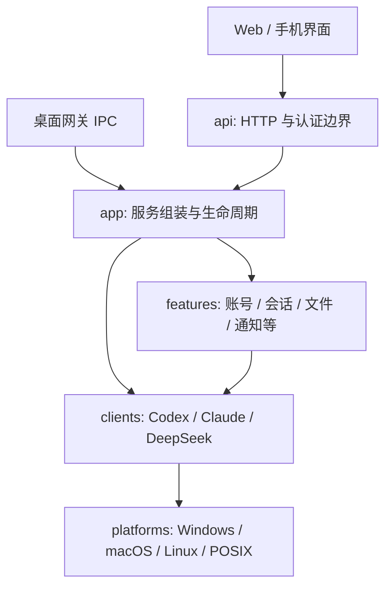

# 开发架构与修改导航

从本页开始找代码。运行机制与协议细节见根目录 [ARCHITECTURE.md](../../ARCHITECTURE.md)；平台修改边界见 [platforms/README.md](../../bridge/platforms/README.md)。本项目按**功能、客户端、操作系统**分别组织，共享业务只保留一份。

## 先判断要改什么

| 需求 | 首先查看 | 需要联动时再看 |
| --- | --- | --- |
| Windows 客户端安装路径、进程、启动和退出 | `bridge/platforms/windows/` | `bridge/clients/discovery.py`、`desktop_app.py`、`lifecycle.py` |
| macOS 屏保、辅助功能、Claude 原生助手 | `bridge/platforms/macos/claude.py`、`claude-helper.swift` | `bridge/clients/claude/setup.py` |
| Ubuntu 安装发现、桌面启动和 IPC | `bridge/platforms/linux/`、`platforms/posix/` | [Linux 说明](../linux.md) |
| 某个客户端的消息、权限、模型、账号 | `bridge/clients/codex/`、`claude/`、`deepseek/` | `bridge/clients/manager.py`，对应 Web 功能模块 |
| 登录、配对、可信手机 | `bridge/features/auth/` | `bridge/api/httpd.py`，`mobile/` 的原生持久化 |
| Codex 账号切换、API、额度、模型列表 | `bridge/features/accounts/` | `bridge/clients/desktop_app.py`，`web/features/accounts/` |
| 会话历史、审批、计划/目标、侧边聊天 | `bridge/features/sessions/` | `bridge/app/service.py`，`web/features/chat/` |
| 文件、图片、上传下载、Git | `bridge/features/workspace/` | `web/features/workspace/`、`web/shared/image-viewer.js` |
| 终端会话与命令 | `bridge/features/terminals/manager.py` | `bridge/platforms/windows/terminal.py`、`posix/terminal.py` |
| 通知、后台巡检、事件游标 | `bridge/features/notifications/` | `desktop/features/notifications/`，`mobile/android/`、`mobile/ios/` |
| 局域网、域名、SSH、Tailscale、中继连接 | `bridge/features/network/` | `desktop/features/connections/`，独立服务 `relay/` |
| 网关更新或 Codex 更新 | `bridge/features/updates/` | `desktop/features/updates/`、签名与构建脚本 |
| 共享聊天功能、应用切换 | `web/features/chat/`、`web/features/clients/` | `web/shell/` |
| 窄屏、横屏、宽屏分屏 | `web/layouts/` | 工作台自身标签/草稿状态仍归 `web/features/workspace/` |
| 浏览器与手机 App 的差别 | `web/hosts/` | `mobile/shared/web/` 共同注入脚本 |
| Android 原生菜单、返回、下载、通知 | `mobile/android/` | 可选推送壳 `mobile/android-push/` |
| iOS 原生菜单、导航、下载、通知 | `mobile/ios/` | Xcode 的 Sources/Resources 与 `WebScripts.swift` |
| 桌面网关页面与模块排布 | `desktop/shell/`、`desktop/features/` | `desktop/index.html`、`main.cjs`、`preload.cjs` |

## 目录与职责

```text
run.py / desktop.py / stop.py     稳定的命令入口
bridge/
  app/                           启停、主服务与功能组装
  api/                           HTTP 路由、请求校验、固定静态资源路由
  features/                      共享业务规则
    auth/ accounts/ sessions/ workspace/ terminals/
    notifications/ network/ updates/
  clients/                       客户端协议与数据格式
    codex/ claude/ deepseek/
    manager.py                   多客户端配置、读请求合并与写操作记录
    discovery.py                 合并安装、登录、能力与运行状态
    desktop_app.py / lifecycle.py 归属核验与安全启停协调
  platforms/                     与操作系统直接交互
    windows/ macos/ linux/ posix/
  resources.py                   源码/冻结运行时的资源定位
web/                             Web 与手机共享聊天界面
  shell/ features/ shared/        共享功能与页面组织
  hosts/                         browser / iOS / Android 宿主适配
  layouts/                       紧凑 / 中等 / 宽屏与容器分屏
desktop/                         桌面网关外壳及功能页面
mobile/
  ios/ android/                  各平台原生壳、扫码、通知、下载
  shared/web/                    两端共用、随 App 打包的注入脚本
  android-push/                  Android 可选推送构建配置
relay/                           独立中继服务及管理页面
scripts/                         测试、构建、验证和受控烟测入口
tests/                           Python 与 Node 回归；browser/ 单列浏览器夹具
```

`features/` 回答“业务允许做什么”；`clients/` 回答“怎样与某个客户端交换状态和命令”；`platforms/` 回答“这个系统如何发现、启动、退出或通信”。具体平台模块不得反向导入 `clients`、`features` 或 `app`。平台目录中的 `AGENTS.md` 会给在相应系统上工作的 Codex 提供约束。

下面是阅读调用链的示意，省略了模块之间已有的协作依赖：



## 顺着一个请求阅读

**Codex 会话发送：**`web/shell/app.js` 组织请求，`api/httpd.py` 验证登录与 CSRF，`app/service.py` 解析会话和原桌面 owner，`clients/codex/ipc.py` 发送受限协议消息，`clients/codex/transport.py` 选择本机的套接字或 Windows 命名管道。消息/审批规范化在 `features/sessions/model.py`，历史在 `store.py`，时间线在 `timeline.py`。

**Claude/DSH 会话操作：**共享页面模块 `web/features/clients/desktop-sessions.js` 调用 HTTP，`clients/manager.py` 处理客户端启用状态、并发只读合并及写入记录，再调用对应 `adapter.py`。Claude 的 mailbox 与 `connector.js`、DSH 的 `host.mjs` 是实际连接协议边界。某种模型或权限差异应在其客户端适配器内处理。

**扫描与启停：**`clients/discovery.py` 调用选中系统的 `discovery.py` 并补充账号、接入和能力信息；`desktop_app.py`/`lifecycle.py` 保留任务及进程归属规则，平台 `desktop.py` 只执行原生查询或启动退出。展示刷新可以共用一次进程清单；关闭、恢复和账号切换必须重新核验。

**客户端启停交互：**`web/features/clients/client-lifecycle.js` 统一 Web、手机和桌面网关的退出选择；客户端页面负责进度与结果展示。`clients/manager.py` 区分关闭接入、正常退出和明确确认的 Windows 强制退出。强制退出不作为正常退出失败后的自动回退，原生实现仍核验目标身份和当前桌面会话。

**Windows 原生入口：**`platforms/windows/discovery_ext.py` 读取注册安装信息；`session.py` 核验桌面可交互状态；`claude.py` 管理原生助手回执和 profile 发现，`claude-helper.cs` 操作指定窗口；`codex_quit.py` / `codex-quit-helper.cs` 与 `dsh_quit.py` 实现客户端正常退出；`force_exit.py` 负责显式强制退出的进程核验。连接重试、取消和任务规则仍在客户端层，不能移入原生助手。

**SSH 工作区：**`app/service.py` 通过 `clients/codex/remote.py` 发送实际 Python 源码到所选远端。远端没有安装本项目包；`source_text()` 读取的模块必须仍可独立运行。Windows 网关连接 Linux 主机时，不能根据本机 Windows 选择远端终端实现。

## 在单个系统上针对性开发

以 Windows 专项修复为例：先阅读 `bridge/platforms/windows/AGENTS.md`，定位命名管道、进程发现或窗口助手。若接口和返回语义不变，只修改该目录及对应测试。不要为了本机测试通过，把其他系统实现替换成 Windows 分支，也不要在共享账号/任务流程内新增平台绕过。

如果改变了共享接口，应同步共享调用者及另外两个系统的实现/合约测试。操作系统相同不代表分发渠道、安装目录、架构、客户端版本相同：保留 MSIX、AppImage、符号链接等既有发现与核验逻辑。Linux 当前可以发现 Claude，但自动连接仍为不支持；目录存在不等于三平台能力完全一致。

在不同电脑上基于同一个确认过的提交创建短期专题分支，例如 `fix/windows-client-discovery`、`fix/linux-terminal`。每个提交只做一个明确改变，记录测试平台、客户端版本和限制；回合并时逐项审核共享层的修改。不要维护三份长期分叉的公共业务代码。

## 新增或调整功能时

1. 在上表定位业务目录；先阅读已有请求与状态流，优先复用组件。
2. 若是客户端协议差异，修改对应客户端目录；若是系统调用差异，修改平台目录；HTTP 入口只负责校验与分派。
3. 保留写入结果未知、不自动重放、任务保护、认证/CSRF、原会话 provider/cwd/owner 等规则。
4. 更新对应测试和功能说明。改公开请求格式时，检查桌面、Web、Android/iOS 及中继消费者。
5. 运行范围匹配的测试，再按 [验证说明](../../tests/README.md) 做必要的共同回归。报告静态检查、模拟测试、真实平台测试和打包测试各自的结果。

## 资源与兼容性

- 外部入口 `run.py`、`desktop.py`、HTTP URL、配置和数据格式保持不变。内部 Python import 已改为新目录，没有旧模块别名层；项目外自写脚本若直接导入旧内部模块，需要参考 [路径对照](path-map.json) 更新。
- `web/assets.json` 映射单一文件或按声明顺序组合的 CSS 源文件；`bridge/api/assets.py` 的固定白名单决定可公开访问的 URL。新增映射不会自动开放任意文件。中继使用同一映射。
- `scripts/gateway-resources.json` 列出必须随网关分发的 SSH 源文件、连接脚本和许可；移动它们时同步清单。CA 证书仍按 TLS 模块的相邻位置分发。
- 桌面页面直接引用一部分 Web 共享文件，需同时更新 `desktop/index.html` 和 `package.json` 资源清单；不要把磁盘路径改动误用为浏览器公开 URL 改动。
- 资源路径回归会在无本地 `bridge` 包的隔离 Python 中执行 SSH 源码定义；这不等于真实 SSH、冻结程序或原生助手已验证。

## 本轮保留的边界

这次整理已经拆出可独立维护的系统实现，重排了功能与客户端模块。`app/service.py`、`api/httpd.py` 和部分页面组织文件仍较大，保留既有业务入口有助于控制回归。后续应沿真实功能需求逐块抽取，避免单纯按行数切文件。

一次性命令执行的 `CommandJob` 仍在终端功能模块内保留系统分支，以保持 SSH 源码自包含；桌面 Electron 主进程内也保留窗口/系统菜单的现有分支。目录划分并不意味着所有 `sys.platform`/`process.platform` 判断已消失。移动端已合并共同注入脚本并分离原生资源加载职责；原生控制器仍保留既有导航和安全回调，避免为了目录分类扩大行为改动。

初次整理的归档、可比结果与未验证范围见 [目录重组验证记录](refactor-verification.md)；后续 iOS/Android 与宽窄布局区分见 [界面分层验证记录](surface-verification.md)；Windows 分支整合见 [合并验证记录](windows-integration.md)。

## 四种访问界面的修改边界

“iOS/Android/浏览器”和“紧凑/中等/宽屏”是独立维度，不维护四份聊天业务代码。手机浏览器仍是浏览器宿主；平板和折叠屏中的 App 可以采用宽屏布局。页面尺寸改变时保留现有会话、草稿、标签、阅读位置和用户分屏选择。

- 修改仅 iOS 的行为：从 `mobile/ios/AGENTS.md` 开始；Android 同理。
- 修改两端共同的原生菜单让位或剪贴板脚本：从 `mobile/shared/AGENTS.md` 开始；源码只存一份，两端构建清单都引用它。
- 修改窄屏/宽屏排布：从 `web/layouts/README.md` 开始；不能靠宿主或设备型号判断可用空间。
- 修改浏览器/App 的功能入口差异：从 `web/hosts/README.md` 开始；宿主提示不提供原生权限。

CSS 按有序源清单在内存中组合，保留原公开样式 URL 与级联顺序，不生成打包文件或增加每个片段的 HTTP 请求。缓存按源文件的修改时间和大小失效，编辑源码后仍可刷新验证。共享原生脚本的来源对照见 `mobile/source-map.json`。
